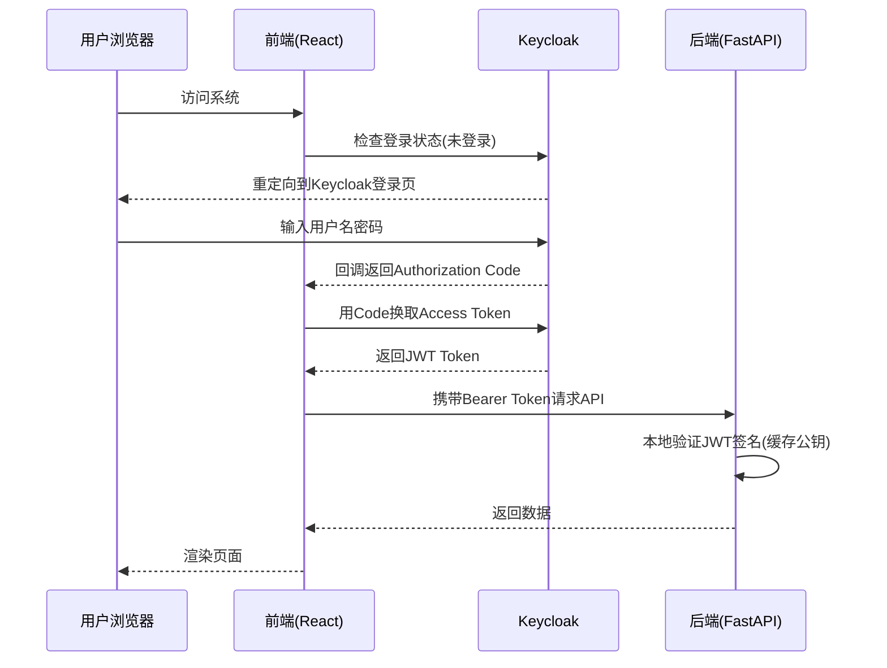

## 产品概述

为现有的测试用例生成工具接入 Keycloak，实现完整的用户认证与鉴权管理体系。项目当前无任何认证机制，所有 API 裸露、前端无登录页面。接入 Keycloak 后，用户必须登录才能访问系统，后端 API 受 Token 保护，数据按用户维度隔离。

## 核心功能

- **Keycloak 部署**：在 docker-compose 中新增 Keycloak 服务，配置 Realm 和 Client
- **后端鉴权**：FastAPI 中间件拦截所有 API 请求，验证 Bearer Token，提取用户信息；Mock 运行路由（/api/mock/）免鉴权
- **前端认证流程**：集成 keycloak-js，实现登录/登出/Token 自动刷新，未登录时重定向到 Keycloak 登录页
- **用户数据隔离**：利用 Keycloak Token 中的用户 ID（sub），激活已有的 user_id 字段，实现 Session、TestCase 等数据按用户隔离
- **Header 用户信息**：顶部导航栏显示当前登录用户名和登出按钮

## 技术栈选择

- **Keycloak 版本**: 24.x（最新稳定版），Docker 部署
- **后端认证库**: `python-jose[cryptography]` — JWT Token 解码与验证（无需回调 Keycloak introspect，本地验证即可）
- **后端 HTTP 客户端**: `httpx` — 已有依赖，用于 Keycloak OIDC 配置获取和公钥缓存
- **前端认证库**: `keycloak-js` — Keycloak 官方 JS 适配器，支持登录/登出/Token 自动刷新
- **前端路由**: 不引入 react-router，沿用当前状态切换导航模式，通过 Keycloak 适配器的 `init` 回调控制认证状态

## 实现方案

### 整体架构



### 后端方案：FastAPI + JWT 本地验证

**核心思路**：后端不依赖 Keycloak 的 introspect 端点做每次验证，而是缓存 Keycloak 的 OIDC 公钥（JWKS），本地验证 JWT 签名。性能好、不依赖 Keycloak 可用性。

1. **配置项**（环境变量）：`KEYCLOAK_SERVER_URL`、`KEYCLOAK_REALM`、`KEYCLOAK_CLIENT_ID`
2. **启动时获取公钥**：从 `{{KEYCLOAK_SERVER_URL}}/realms/{{REALM}}/protocol/openid-connect/certs` 获取 JWKS，缓存到内存，定期刷新
3. **认证依赖**：`get_current_user()` FastAPI Dependency，从 `Authorization: Bearer <token>` 提取并验证 JWT，返回用户信息（`user_id`, `username`, `email`）
4. **路由保护策略**：

- `/api/mock/{path}` — **免鉴权**（Mock 接口需外部可访问）
- `/api/health` — **免鉴权**
- 其他所有 `/api/*` — **需鉴权**

5. **用户信息注入**：`get_current_user()` 返回 `UserInfo` 对象，路由函数通过依赖注入获取

### 前端方案：keycloak-js 适配器

1. **初始化**：App.tsx 中创建 Keycloak 实例，调用 `keycloak.init({ onLoad: 'login-required', checkLoginIframe: false })`
2. **Token 管理**：keycloak-js 内置 Token 刷新（`onTokenExpired` 回调自动调用 `updateToken`）
3. **API 拦截器**：在 Axios 请求拦截器中注入 `Authorization: Bearer ${keycloak.token}`
4. **401 处理**：响应拦截器中检测 401，调用 `keycloak.login()` 重新认证
5. **Header 组件**：显示用户名 + 登出按钮，调用 `keycloak.logout()`

### 数据隔离方案

1. 在路由层通过 `get_current_user()` 获取 `user_id`（取 Keycloak JWT 的 `sub` 字段）
2. 查询时自动添加 `WHERE user_id = current_user_id` 过滤
3. 创建时自动填充 `user_id` 字段
4. 激活 `SavedRequest.user_id` 和 `GlobalParameter.user_id`
5. 为 `Session`、`TestCase`、`Module`、`HistoryPrompt`、`ScheduledTask`、`MockConfig` 添加 `user_id` 字段

### Keycloak 配置方案

1. 创建 Realm `ai-testcase`
2. 创建 Client `frontend`（标准 OpenID Connect 流程）
3. 创建角色 `admin`、`user`（预留权限分级）
4. 首个 admin 用户通过 Keycloak 管理控制台创建

## 实现细节

### Keycloak JWKS 公钥缓存

- 启动时从 Keycloak 获取 JWKS 公钥
- 每 24 小时自动刷新一次（后台定时任务）
- 如果验证失败且错误为签名不匹配，立即刷新公钥重试
- 公钥缓存使用 python-jose 的 `jwk` 模块

### Mock 路由免鉴权实现

在 `backend/app/main.py` 的路由注册中，给 `mock_server_router` 单独处理，不挂载全局鉴权中间件，而是通过路由级别的 `dependencies` 参数控制。具体方式：

```python
# 在 api_router 注册时，对 mock_server 路由跳过鉴权
# 其他路由通过 dependencies=[Depends(require_auth)] 保护
```

### CORS 调整

接入 Keycloak 后，CORS 需要限制 `allow_origins` 为前端实际域名，不再使用 `["*"]`，否则 `allow_credentials=True` 与 `allow_origins=["*"]` 冲突。

### 环境变量管理

所有 Keycloak 配置通过环境变量注入，支持本地开发和 Docker 部署两种场景：

- 本地开发：在 `.env` 文件中配置
- Docker 部署：在 docker-compose.yml 中配置

## 目录结构

```
f:\VSCode\ai-generate-testcase\
├── docker-compose.yml                    # [MODIFY] 新增 keycloak 和 postgres 服务，添加环境变量
├── backend/
│   ├── requirements.txt                  # [MODIFY] 新增 python-jose[cryptography], pyyaml
│   ├── main.py                           # [MODIFY] 添加 Keycloak 配置初始化、CORS origins 收窄
│   ├── config.py                         # [MODIFY] 新增 Keycloak 配置项（server_url, realm, client_id）
│   ├── .env.example                      # [NEW] 环境变量模板
│   ├── app/
│   │   ├── deps.py                       # [MODIFY] 新增 get_current_user 依赖、CurrentUser 类型
│   │   ├── auth.py                       # [NEW] Keycloak JWT 验证核心逻辑：JWKS 公钥获取缓存、Token 解码验证、UserInfo 提取
│   │   ├── main.py                       # [MODIFY] 路由注册时区分鉴权/免鉴权路由
│   │   └── routes/
│   │       ├── session.py                # [MODIFY] 添加 user_id 过滤和自动填充
│   │       ├── testcase.py               # [MODIFY] 添加 user_id 过滤
│   │       ├── module.py                 # [MODIFY] 添加 user_id 过滤
│   │       ├── saved_request.py          # [MODIFY] 激活 user_id，添加过滤
│   │       ├── global_parameter.py       # [MODIFY] 激活 user_id，添加过滤
│   │       ├── history_prompt.py         # [MODIFY] 添加 user_id 过滤
│   │       ├── scheduled_task.py         # [MODIFY] 添加 user_id 过滤
│   │       ├── mock_config.py            # [MODIFY] 添加 user_id 过滤
│   │       └── mock_server.py            # [不修改] Mock 运行路由免鉴权
│   └── db/
│       └── models.py                     # [MODIFY] 为 Session, TestCase, Module, HistoryPrompt, ScheduledTask, MockConfig 添加 user_id 字段
├── frontend/
│   ├── package.json                      # [MODIFY] 新增 keycloak-js 依赖
│   ├── vite.config.ts                    # [MODIFY] 添加 Keycloak 相关环境变量代理
│   ├── .env.example                      # [NEW] 前端环境变量模板
│   ├── src/
│   │   ├── App.tsx                       # [MODIFY] 包裹 KeycloakProvider，未登录时显示加载/登录
│   │   ├── services/
│   │   │   ├── api.ts                    # [MODIFY] 请求拦截器注入 Bearer Token，401 自动刷新/重登录
│   │   │   └── keycloak.ts              # [NEW] Keycloak 实例初始化、配置导出
│   │   ├── components/
│   │   │   └── HeaderComponent.tsx       # [MODIFY] 显示用户名 + 登出按钮
│   │   └── types/
│   │       └── index.ts                  # [MODIFY] 各接口添加 user_id 字段
```

## 关键代码结构

### 后端 auth.py 核心接口

```python
class KeycloakConfig:
    keycloak_server_url: str   # e.g. http://keycloak:8080
    realm: str                 # e.g. ai-testcase
    client_id: str             # e.g. frontend

class UserInfo:
    user_id: str    # Keycloak sub (UUID)
    username: str
    email: str | None
    roles: list[str]

def get_jwks() -> dict:
    """从 Keycloak 获取 JWKS 公钥，带内存缓存和定时刷新"""

def verify_token(token: str) -> UserInfo:
    """验证 JWT Token 签名和有效期，返回用户信息"""

async def get_current_user(authorization: str = Header(...)) -> UserInfo:
    """FastAPI 依赖：从请求头提取并验证 Bearer Token"""
```

### 后端 deps.py 新增依赖

```python
CurrentUser = Annotated[UserInfo, Depends(get_current_user)]
```

### 前端 keycloak.ts 核心接口

```typescript
// keycloak.ts
import Keycloak from 'keycloak-js';

const keycloak = new Keycloak({
  url: import.meta.env.VITE_KEYCLOAK_URL,
  realm: import.meta.env.VITE_KEYCLOAK_REALM,
  clientId: import.meta.env.VITE_KEYCLOAK_CLIENT_ID,
});

export default keycloak;
```

## 设计方案

在现有 Ant Design 布局基础上，仅在 HeaderComponent 中新增用户信息区域，不涉及页面级别重构。

### HeaderComponent 改造

将现有 Header 右侧区域从仅有"设置"按钮，扩展为包含用户头像/用户名 + 登出按钮 + 设置按钮的布局。用户名从 Keycloak Token 的 `preferred_username` 中提取。

### 登录过渡页

Keycloak-js 采用 `login-required` 模式，未登录时自动重定向到 Keycloak 登录页，无需自建登录页面。在重定向前显示 Ant Design 的 Spin 加载状态。