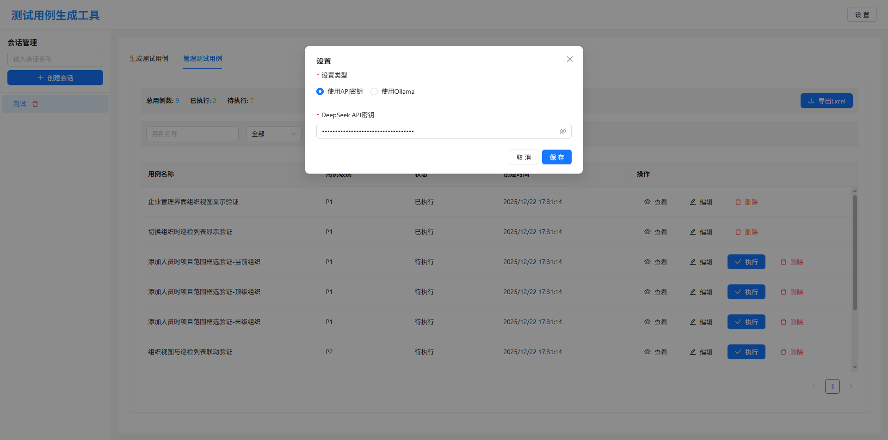
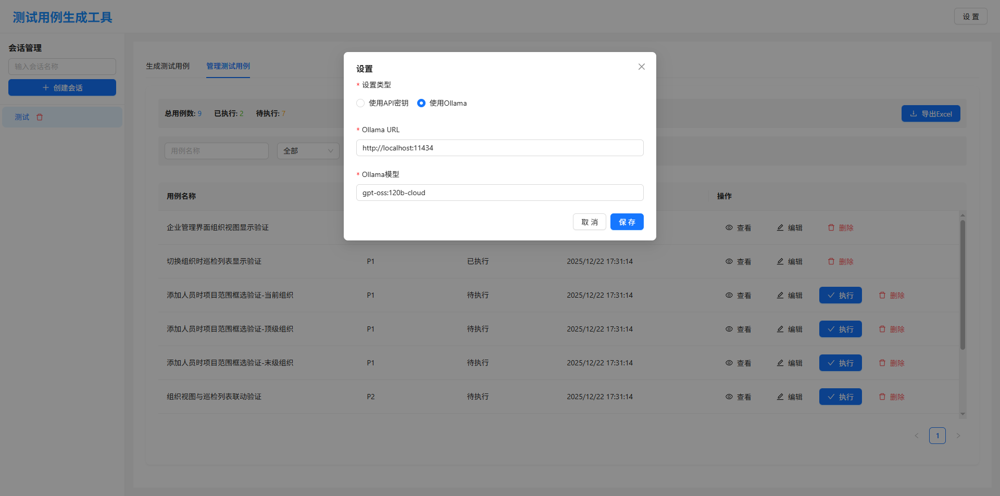
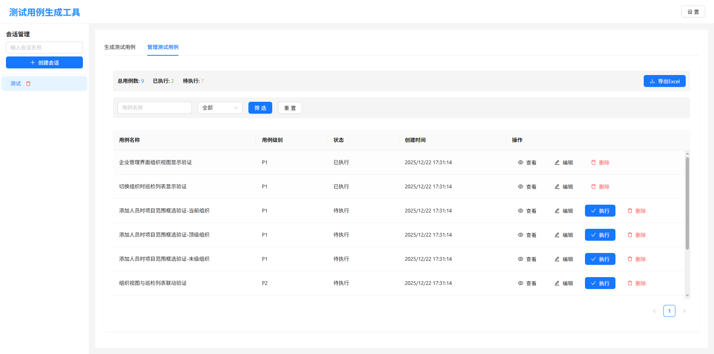
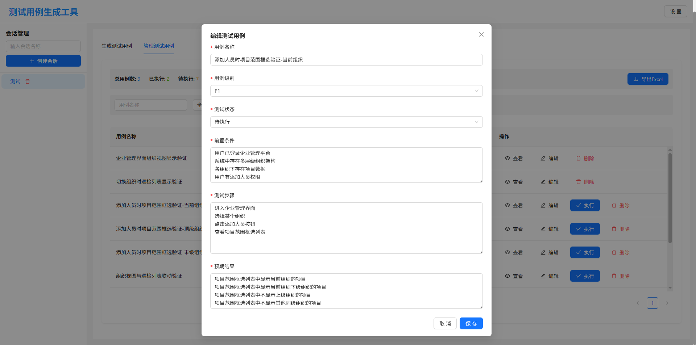

# Testcase Generator — repo notes

快速说明

- 后端：FastAPI（`backend/main.py`）。启动：

```bash
cd backend
python -m venv .venv
# linux
source .venv/bin/activate  # 创建虚拟环境
# windows
.venv/Scripts/activate
pip install -r requirements.txt
uvicorn backend.main:app --reload
```


- 前端：React + Vite（`frontend/`）。启动：

```bash
cd frontend
npm install
pnpm dev
```


关键约定

- API 返回格式：`response: List[TestCase]`（参见 `backend/utils/model_utils.py`）。
- 数据库：SQLite 文件位于 `backend/data/testcases.db`。
- 模型：LangChain agent 在 `backend/utils/model_utils.py`，支持 `api`（DeepSeek）和 `ollama` 两种模式。

## 快速开始
### 设置
* deepseek api key:

* ollama:

### 测试用例列表页

### 测试用例详情页

### 测试用例编辑页

