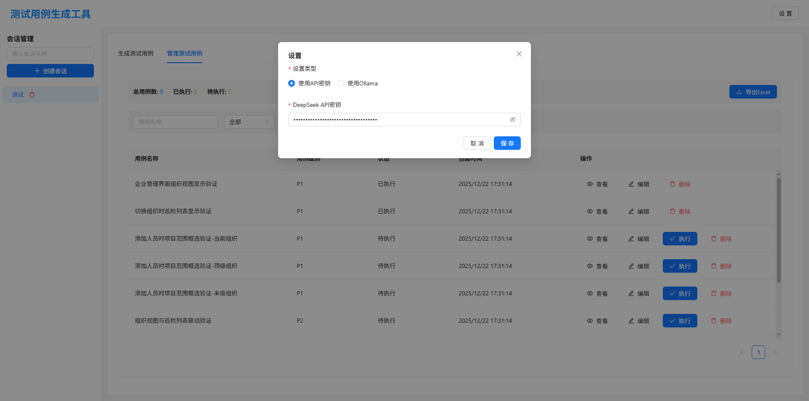
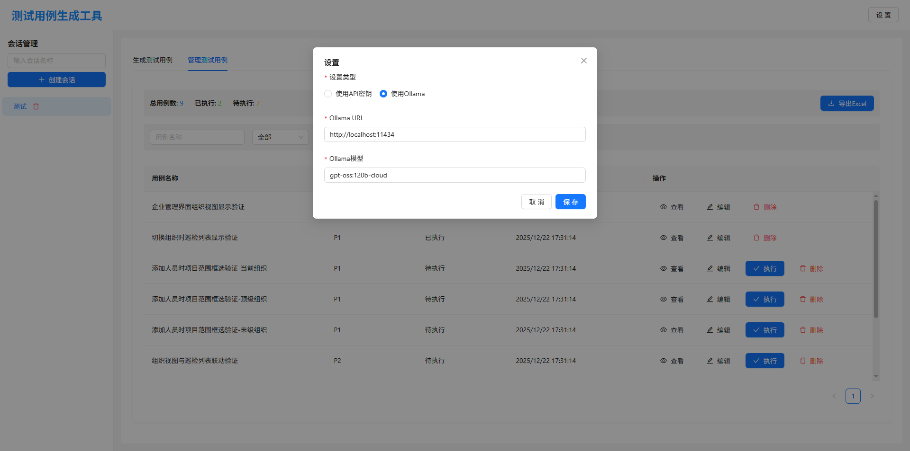
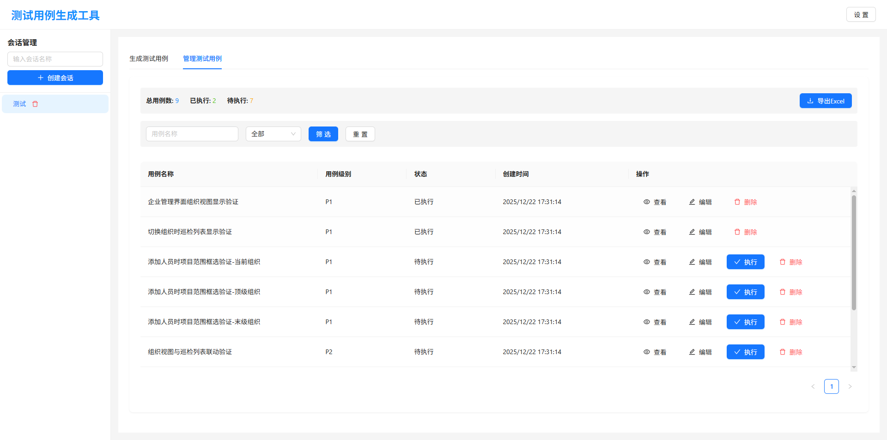
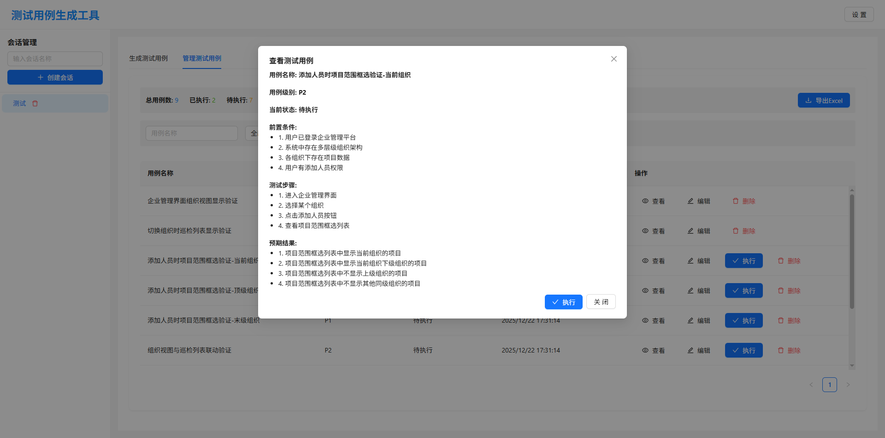
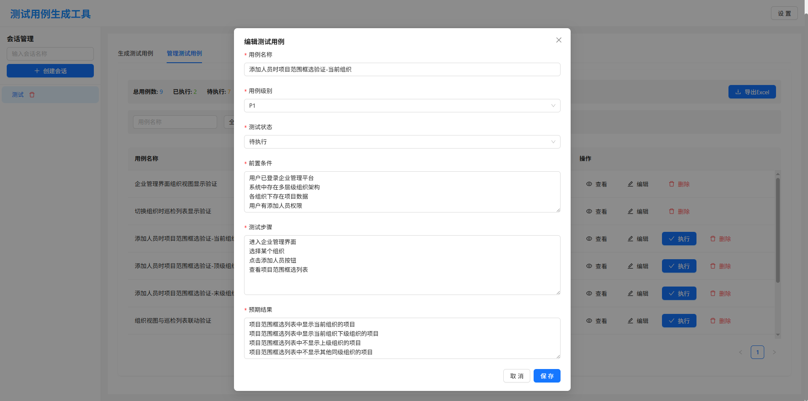

# Testcase Generator — repo notes

快速说明

- 后端：FastAPI（`backend/main.py`）。启动：

```bash
cd backend
python -m venv .venv
# linux
source .venv/bin/activate  # 创建虚拟环境
# windows
.venv/Scripts/activate
pip install -r requirements.txt
uvicorn backend.main:app --reload
```


- 前端：React + Vite（`frontend/`）。启动：

```bash
cd frontend
npm install
pnpm dev
```


关键约定

- API 返回格式：`response: List[TestCase]`（参见 `backend/utils/model_utils.py`）。
- 数据库：SQLite 文件位于 `backend/data/testcases.db`。
- 模型：LangChain agent 在 `backend/utils/model_utils.py`，支持 `api`（DeepSeek）和 `ollama` 两种模式。

## 快速开始
### 设置
* deepseek api key:

* ollama:

### 测试用例列表页

### 测试用例详情页

### 测试用例编辑页


## 环境变量与发布配置

本项目把“代码/镜像”和“环境配置”分开管理。真实 `.env` 文件不应提交到仓库；仓库只保留 `.env.example`、`backend/.env.example`、`frontend/.env.example` 作为模板。

### 应该修改哪个 `.env`

不同启动方式读取的配置文件不同：

| 启动方式 | 需要修改的文件 | 说明 |
| --- | --- | --- |
| Docker Compose 部署 | 根目录 `.env` | 生产/测试环境推荐方式。改完后重启容器即可。 |
| 本地启动后端 | `backend/.env` | 使用 `cd backend && uvicorn main:app --reload` 时生效。 |
| 本地启动前端 | `frontend/.env`、`frontend/.env.development` | 使用 `cd frontend && npm run dev` 时生效。 |

生产发布时通常只需要修改根目录 `.env`：

```env
VITE_KEYCLOAK_URL=https://auth.example.com
KEYCLOAK_EXTERNAL_URL=https://auth.example.com
KEYCLOAK_HOSTNAME=auth.example.com
CORS_ORIGINS=https://app.example.com

FRONTEND_PORT=8001
BACKEND_PORT=8000
KEYCLOAK_PORT=8090
```

改完后重启服务：

```bash
docker compose --env-file .env up -d
```

如果同时修改了代码、依赖或 Dockerfile，再重新构建：

```bash
docker compose --env-file .env up -d --build
```

前端 Docker 镜像会在容器启动时根据根目录 `.env` 传入的环境变量生成 `/config.js`。因此只改 Keycloak 地址、CORS、端口等部署配置时，不需要重新构建前端镜像，只需要重启容器。

### Docker Compose 部署

Docker Compose 使用根目录 `.env` 或 `--env-file` 提供部署参数。首次部署可以复制模板：

```bash
copy .env.example .env
```

Linux/macOS 使用：

```bash
cp .env.example .env
```

然后按实际环境修改 `.env`，再启动：

```bash
docker compose --env-file .env up -d --build
```

常用变量：

```env
FRONTEND_PORT=8001
BACKEND_PORT=8000
KEYCLOAK_PORT=8090

VITE_KEYCLOAK_URL=http://localhost:8090
KEYCLOAK_EXTERNAL_URL=http://localhost:8090
KEYCLOAK_HOSTNAME=localhost

CORS_ORIGINS=http://localhost:5173,http://localhost:8001
```

生产环境通常需要把这些值改成实际域名或服务器 IP，例如：

```env
VITE_KEYCLOAK_URL=https://auth.example.com
KEYCLOAK_EXTERNAL_URL=https://auth.example.com
KEYCLOAK_HOSTNAME=auth.example.com
CORS_ORIGINS=https://app.example.com
```

### 前端配置生效逻辑

前端运行时会加载 `/config.js`，并优先读取：

```js
window.__APP_CONFIG__
```

Docker 镜像启动时会根据容器环境变量自动生成 `/config.js`，因此生产环境修改 Keycloak 地址、realm、client id 等配置后，只需要重启容器，不需要重新构建前端代码。

本地 Vite 开发仍然读取 `frontend/.env`、`frontend/.env.development` 中的 `VITE_*` 变量：

```bash
cd frontend
npm install
npm run dev
```

前端相关变量：

```env
VITE_KEYCLOAK_URL=http://localhost:8090
VITE_KEYCLOAK_REALM=ai-testcase
VITE_KEYCLOAK_CLIENT_ID=frontend
VITE_KEYCLOAK_BACKEND_CLIENT_ID=backend
VITE_KEYCLOAK_PKCE_METHOD=S256
```

### 后端配置生效逻辑

后端本地运行时会通过 `python-dotenv` 加载 `backend/.env`：

```bash
cd backend
uvicorn main:app --reload
```

Docker Compose 运行时，后端环境变量由 `docker-compose.yml` 中的 `${VAR:-default}` 从根目录 `.env` 或 `--env-file` 注入。

后端关键变量：

```env
KEYCLOAK_SERVER_URL=http://keycloak:8080
KEYCLOAK_EXTERNAL_URL=http://localhost:8090
KEYCLOAK_REALM=ai-testcase
KEYCLOAK_BACKEND_CLIENT_ID=backend
CORS_ORIGINS=http://localhost:5173,http://localhost:8001
```

其中：

- `KEYCLOAK_SERVER_URL` 是后端访问 Keycloak 的内部地址。Docker 内通常为 `http://keycloak:8080`。
- `KEYCLOAK_EXTERNAL_URL` 必须与浏览器访问 Keycloak 的地址一致，也要与 JWT issuer 匹配。
- `VITE_KEYCLOAK_URL` 是浏览器访问 Keycloak 的地址，不能写 Docker 内部服务名 `http://keycloak:8080`。
- `CORS_ORIGINS` 是允许调用后端 API 的前端来源，多个值用英文逗号分隔。

### 配置文件提交规则

不要提交真实环境配置和本地数据文件：

- `.env`
- `backend/.env`
- `frontend/.env`
- `frontend/.env.development`
- `backend/data/testcases.db`
- `backend/data/config.json`

需要新增配置项时，同时更新对应的 `.env.example` 文件。
